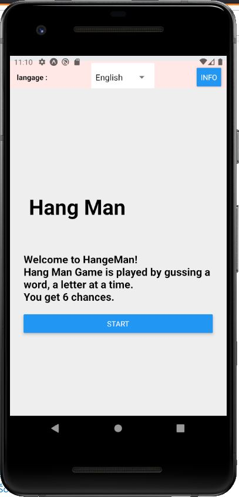
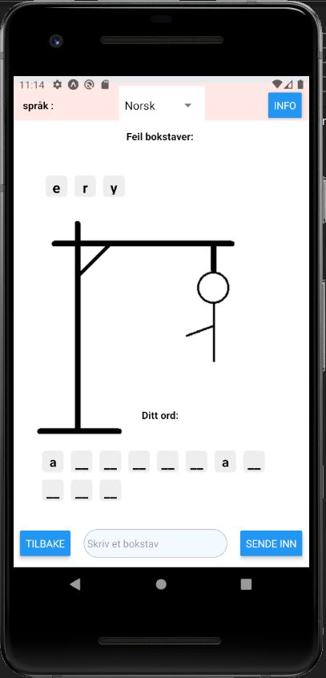
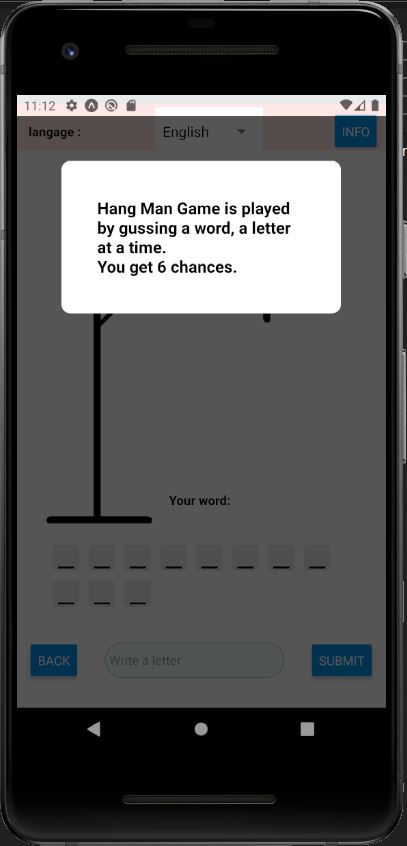

# HangMan
HangMang game written in React Native.

About the game:
You have to guess a word, by guessing one letter a time.
You get 6 wrong guesses before loosing.

The game supports two languages English and Norwegian Bokmål.


you can run on a virtual android emulator to play the game.


## Prerequisites 

[NodeJs](https://nodejs.org/en/)

[Java SE Development Kit (JDK)](https://openjdk.java.net/projects/jdk8/)

[Android Studio and Android SDK](https://developer.android.com/studio). You can follow the instructions [here](https://reactnative.dev/docs/environment-setup) under "React Native CLI Quickstart" section 1. Install Android Studio 


## installation 


Assuming that you have the Prerequisites listed above.
you need to clone the project on your machine.
run the following commands on your command line.

```
git clone https://github.com/mh-8man/HangMan.git

cd HangMan
```

your need to install npm dependencies.

```
npm install
```
you can go ahead and run the game in your android emulator.

```
npm start
```

in case of failure that it is missing expo. You can install expo by ruunning the command. and then starting the game again.

```
npm install -g expo-cli
npm start
```

Expo will open a new tap on your Browser. From that browser press on run android emulator. This should open the emulator and run the game. 

Have fun!  


## Game play

when running the game you begin in the home/start screen.



You can change the language by pressing on the picker on the top bar. This changes the game text language and the language of the word you have to guess.
Then you press start to begin the game



you can always read how to play the game by pressing the the info button on the upper right corner.

